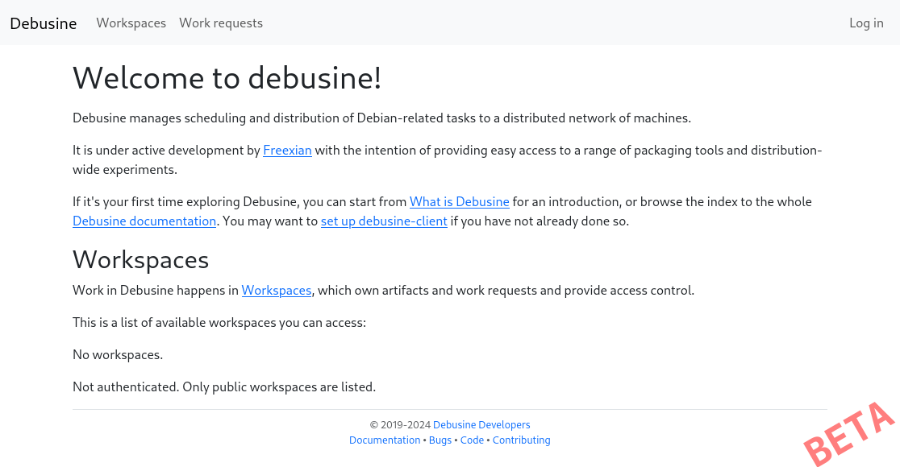

.. _tutorial-install-debusine:

====================================
Install your first Debusine instance
====================================

In this tutorial, you will install your first Debusine server and your
first Debusine worker. To provide a reproducible experience in a well
defined environment, you will install both in the same virtual machine
running Debian 12 (bookworm).

.. note::

   We will use `Incus <https://linuxcontainers.org/incus/>`_ to manage
   this virtual machine. Given that incus is an LXD fork, you might be able
   to easily translate the samples for LXD. If you are more familiar with
   other virtualization tools (libvirt and virt-manager, virtualbox,
   etc.), feel free to use those and to adapt the instructions.

Configure the hypervisor to host the Debusine instance (with Incus)
-------------------------------------------------------------------

If you have never used Incus, you have to install it and configure it:

.. code-block:: console

   $ sudo apt install incus
   [...]
   Incus has been installed. You must run `sudo incus admin init` to
   perform the initial configuration of Incus.
   Be sure to add user(s) to either the 'incus-admin' group for full
   administrative access or the 'incus' group for restricted access,
   then have them logout and back in to properly setup their access.

   $ sudo incus admin init --auto

.. warning::

   Incus is very recent and is not present in any stable Debian releases.
   You can find the package in Debian Testing and Debian Unstable, and
   in bookworm-backports (backports for Debian 12).
   You can also use the upstream packages from
   https://github.com/zabbly/incus.

To make the system-wide incus daemon fully controllable by your user, run
this command:

.. code-block:: console

   $ sudo adduser $USER incus-admin
   info: Adding user `sample-user' to group `incus-admin' ...
   $ newgrp incus-admin

.. note::

   The `newgrp incus-admin` command starts a new shell where you
   immediately have the newly granted group. Otherwise you have to
   close your session and start a new one to get the new privilege.

Install the Debusine virtual machine
------------------------------------

With incus, there's no installation involved, as we can simply rely
on the pre-built images provided by the linux containers project. So
you can instantiate and start a new virtual machine with this single
command:

.. code-block:: console

   $ incus launch images:debian/bookworm/cloud debusine --vm \
       -c limits.memory=2GiB --device root,size=50GiB
   Creating debusine
   Starting debusine

From there, you can execute any command within the virtual machine
with ``incus exec debusine -- $COMMAND`` (replacing ``$COMMAND`` with
the command of your choice). You can also easily start a shell inside the
virtual machine:

.. code-block:: console

   $ incus shell debusine
   root@debusine:~# cat /etc/debian_version
   12.7

.. warning::

   Note that you can only execute a command once the virtual machine has
   finished to boot (it can take up to a few tens of seconds). In the mean
   time, the above command might return an error (`Error: VM agent isn't
   currently running`).

All the commands in this tutorial that start with the ``root@debusine``
prompt are to be executed in such a shell inside the virtual machine.

In order to work properly, the Debusine server needs to have a fully
qualified domain name and unfortunately Incus doesn't set one for us.
Let's fix this by granting the ``debusine.internal`` name on top of the
plain unqualified hostname (``debusine``):

.. code-block:: console

   root@debusine:~# sed -i -e "s/$HOSTNAME/debusine.internal &/" /etc/hosts
   root@debusine:~# hostname -f
   debusine.internal

Install the packages
--------------------

First you want to configure APT with the bookworm-backports repository:

.. code-block:: console

   root@debusine:~# cat >/etc/apt/sources.list.d/bookworm-backports.list <<END
   deb http://deb.debian.org/debian bookworm-backports main
   END
   root@debusine:~# apt update
   […]

Then you install a bunch of packages:

* the three packages for the Debusine server, the worker, and the signing
  worker
* some Debian tools that are required for the worker to be able to perform
  some useful tasks
* the postgresql database server
* the redis database server
* the nginx webserver

This will prompt for database configuration for ``debusine-signing`` and
``debusine-server``; you can press Enter at each prompt to accept the
defaults.

.. code-block:: console

   root@debusine:~# apt install \
    debusine-server debusine-worker debusine-signing \
    libjs-bootstrap5/bookworm-backports python3-django/bookworm-backports \
    postgresql redis nginx \
    sbuild uidmap autopkgtest lintian piuparts mmdebstrap qemu-system \
    sbsigntool
   […]
   root@debusine:~# apt install --no-install-recommends devscripts
   […]

.. note::

   If you are also running docker on the same computer, you might
   discover at this point that the network is not functional inside the
   virtual machine. This is usually due to docker configuring restrictions
   in the local firewall when the service has to enable IPv4 forwarding.
   See the `incus documentation
   <https://linuxcontainers.org/incus/docs/main/howto/network_bridge_firewalld/#prevent-connectivity-issues-with-incus-and-docker>`__
   for possible solutions.

..
   We might want a "debusine-debian-worker" package that pulls all the
   important dependencies and that perform any system wide setup we might
   need.

Configure the webserver
-----------------------

You will now configure the webserver:

.. code-block:: console

   root@debusine:~# rm -f /etc/nginx/sites-enabled/default
   root@debusine:~# cp /usr/share/doc/debusine-server/examples/nginx-vhost.conf \
     /etc/nginx/sites-enabled/debusine
   root@debusine:~# systemctl restart nginx

Test the access to the web interface
------------------------------------

Now it's time to ensure that you can open Debusine's web interface.

The default configuration of the Debusine server assumes that you will
access it through the fully qualified name obtained with ``hostname -f``
in the virtual machine.

On your machine, you can look up the IPv4 address assigned to your virtual
machine, associate it with the same hostname by creating an entry in
``/etc/hosts``, and open your web browser on the corresponding URL:

.. code-block:: console

   $ DEBUSINE_HOSTNAME=$(incus exec debusine -- hostname -f)
   $ IPV4=$(incus list debusine -c 4 -f csv | awk '{print $1}')
   $ echo "$IPV4 $DEBUSINE_HOSTNAME" | sudo tee -a /etc/hosts
   10.178.127.31 debusine.internal
   $ xdg-open http://$DEBUSINE_HOSTNAME/

If you want to be able to connect to Debusine over HTTPS (optional), extract
the virtual machine's self-signed certificate and add it to your machine's
certificate collection.  You can then open your web browser on the
corresponding HTTPS URL, although you'll have to accept a security warning
about the self-signed certificate:

.. code-block:: console

   $ incus exec debusine -- cat /etc/ssl/certs/ssl-cert-snakeoil.pem | \
       sudo tee "/usr/local/share/ca-certificates/$DEBUSINE_HOSTNAME.crt" >/dev/null
   $ sudo update-ca-certificates
   $ xdg-open https://$DEBUSINE_HOSTNAME/

The Debusine server is running:

You notice a login button, but you don't know what credentials to enter.
Let's fix this. Go back in the server virtual machine and use the
``debusine-admin create_user USERNAME EMAIL`` command to create yourself
a user in the system:

.. code-block:: console

   root@debusine:~# sudo -u debusine-server debusine-admin create_user \
        myuser user@example.org
   I4X'JISFj7GhOvN1

The password that has been assigned to the newly created user is displayed
on standard output. Go back to the web browser, and try it out!

Configure the worker
--------------------

While the server part is now ready, the worker isn't yet. First step is to
configure the worker so that it connects to the server and make itself
available:

.. code-block:: console

   root@debusine:~# cp /usr/share/doc/debusine-worker/examples/config.ini \
        /etc/debusine/worker/
   root@debusine:~# sed -i -e "s/localhost/debusine.internal/" \
        /etc/debusine/worker/config.ini
   root@debusine:~# systemctl restart debusine-worker

.. note:: The sample configuration file uses ``http://localhost/api`` as
   the server URL and we change it to ``http://debusine.internal/api`` for
   consistency.

Finally, you approve the worker on the server side:

.. code-block:: console

   root@debusine:~# sudo -u debusine-server debusine-admin worker list
                      ╷          ╷                                  ╷                                  ╷                                                                  ╷
    Name              │ Type     │ Registered                       │ Connected                        │ Token hash (do not copy)                                         │ Enabled
   ═══════════════════╪══════════╪══════════════════════════════════╪══════════════════════════════════╪══════════════════════════════════════════════════════════════════╪═════════
    celery            │ celery   │ 2024-10-21T16:35:51.794049+00:00 │ 2024-10-21T16:35:57.421756+00:00 │ -                                                                │ True
    debusine-internal │ external │ 2024-10-21T16:38:35.055060+00:00 │ -                                │ f91c098316e728ff90d47ac504179460a0d50501b955b5f9f8a3b72ddfd67dad │ False
                      ╵          ╵                                  ╵                                  ╵                                                                  ╵
   root@debusine:~# sudo -u debusine-server \
        debusine-admin worker enable debusine-internal

The recommended worker backend for Debusine is Incus. To use this,
install Incus on your Debusine worker. For more details, see
:ref:`set-up-incus`:

.. code-block:: console

   root@debusine:~# apt install incus
   root@debusine:~# /usr/share/doc/debusine-worker/examples/configure-worker-incus.sh

The worker is now ready to process work requests.

Configure the signing worker
----------------------------

There is a separate signing worker that needs to be configured in a similar
way to the ordinary (external) worker:

.. code-block:: console

   root@debusine:~# cp /usr/share/doc/debusine-signing/examples/config.ini \
        /etc/debusine/signing/
   root@debusine:~# sed -i -e "s/localhost/debusine.internal/" \
        /etc/debusine/signing/config.ini
   root@debusine:~# sudo -u debusine-signing \
        debusine-signing generate_service_key /etc/debusine/signing/0.key
   root@debusine:~# systemctl restart debusine-signing

For the signing worker to be able to fetch artifacts from the server, it
needs to trust the server's HTTPS certificate:

.. code-block:: console

   root@debusine:~# cp /etc/ssl/certs/ssl-cert-snakeoil.pem \
        "/usr/local/share/ca-certificates/$(hostname -f).crt"
   root@debusine:~# update-ca-certificates

Approve the signing worker on the server side:

.. code-block:: console

   root@debusine:~# sudo -u debusine-server debusine-admin worker list
                        ╷          ╷                                  ╷                                  ╷                                                                  ╷
    Name                │ Type     │ Registered                       │ Connected                        │ Token hash (do not copy)                                         │ Enabled
   ═════════════════════╪══════════╪══════════════════════════════════╪══════════════════════════════════╪══════════════════════════════════════════════════════════════════╪═════════
    celery              │ celery   │ 2024-10-21T16:35:51.794049+00:00 │ 2024-10-21T16:35:57.421756+00:00 │ -                                                                │ True
    debusine-internal   │ external │ 2024-10-21T16:38:35.055060+00:00 │ 2024-10-21T16:39:31.317862+00:00 │ f91c098316e728ff90d47ac504179460a0d50501b955b5f9f8a3b72ddfd67dad │ True
    debusine-internal-2 │ signing  │ 2024-10-21T16:39:57.351233+00:00 │ -                                │ 568cd68b5834da9bf223c7760226ff739caf2a461dbff2b524c35da26db2f280 │ False
                        ╵          ╵                                  ╵                                  ╵                                                                  ╵
   root@debusine:~# sudo -u debusine-server \
        debusine-admin worker enable --worker-type signing debusine-internal-2

Next steps
----------

You can start to experiment with Debusine's features. For this, you can
follow the tutorial :ref:`tutorial-getting-started`.
